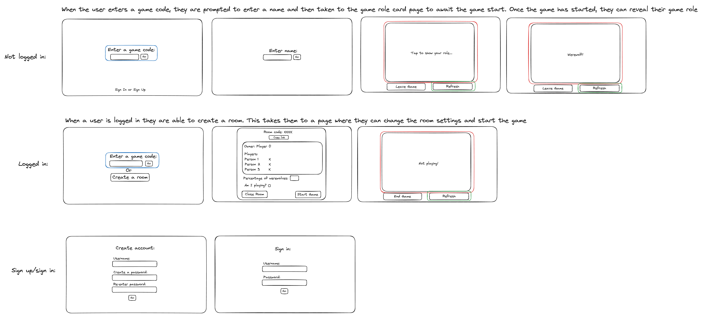
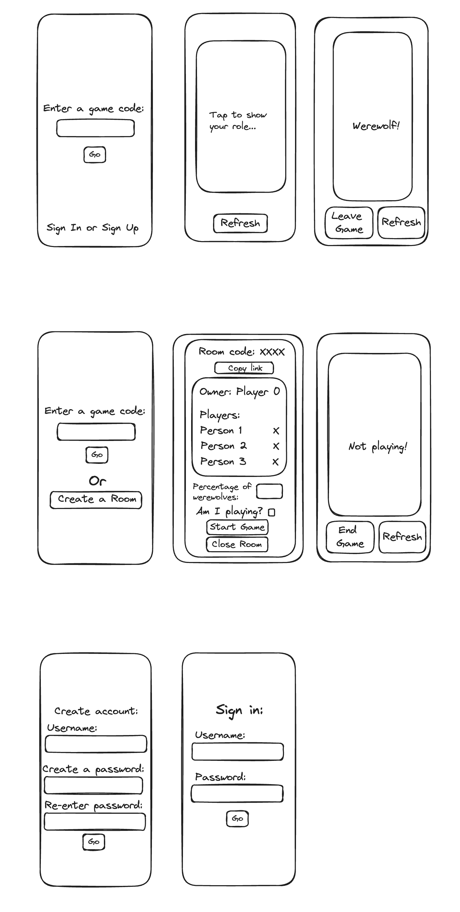
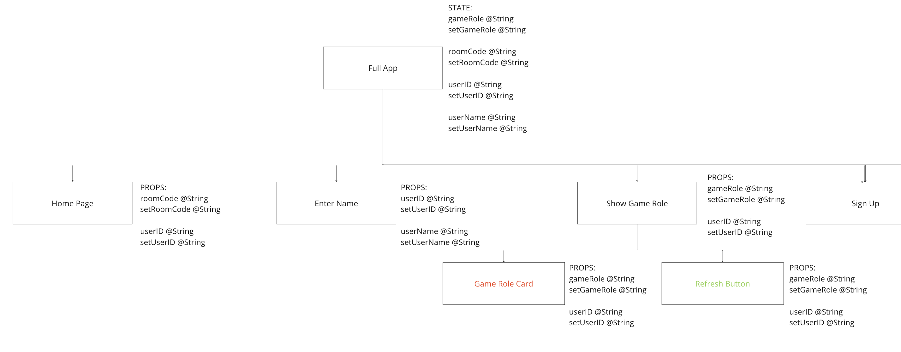
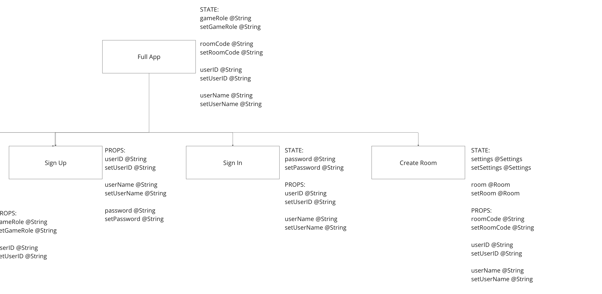
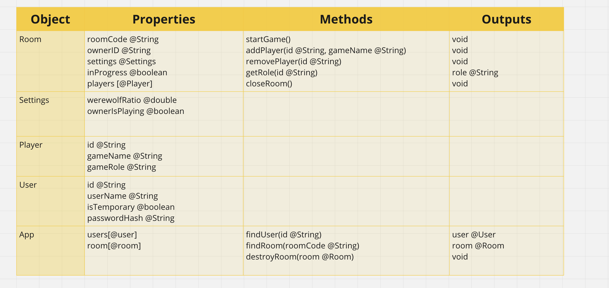

# Passion Project - Werewolves: A Companion App to the Table-Top Party Game

## Description:

I will be developing a companion program for a party game similar to the popular games Mafia and Werewolves. A logged-in player will be able to set up a ‘room’ which non-logged-in players will be able to join, as well as choose some simple game settings. Once the logged-in user has confirmed that all the other players are in the room, they can begin the game, which will assign roles to all players. The rest of the game will be played in person until it concludes. Afterward, the room owner can restart the game and assign new roles for another round.

## Context:

According to global data and business intelligence platform Statista, total revenue in the board games market was estimated to reach US$2.12bn in 2022 alone, and is anticipated to grow at a compound annual growth rate of 3.52% from 2024 to 2028 [1], making this a colossal market which is only growing in size. For many, one of the key obstacles to getting into any board game is the organisational and equipment requirements to running a gaming session, the game Werewolves being no exception; By using a companion web application that can run on a mobile phone instead of using physical cards, a lot of the obstacles with this game can be removed, while still maintaining the face-to-face social elements that make the original so enjoyable.
Although my main interest in developing this project is to play with my own friends, it could easily be extended this larger market.\
\
In summary, below are the key problems that will be solved by this project:

- The game in its current form requires some cards and/or preparation and organisation. By using only a mobile phone, this can be removed, allowing the game to be played in a variety of settings that would previously have been difficult, as well as allowing the game to be suggested and started in as short a time as possible.
- Current online versions of the game exist, but are played entirely over the internet, removing some of the most enjoyable social aspects. By leaving as much as possible to in-person interaction, the key elements of the game are maintained.
- Time between rounds must be spent collecting, shuffling and dealing cards. This can be reduced by using the application, allowing for more gameplay time.

## Features:

- A user will be able to create an account - Create user object
- A user will be able to sign in to an account - Read user object
- A signed-in user will be able to create a ‘room’ - Create room object
- The ‘room’ owner will be able to choose the ratio of werewolves to villagers - Update settings object
- Any user will be able to join a room using a room code - Create user object, Update room object
- The ‘room’ owner will be able to see the other users in the ‘room’ - Read room object
- The ‘room’ owner will be able to start the game - Update room object
- The game will assign roles - Update room object
- The users will be able to view their roles once the game has started - Read room object
- The ‘room’ owner will be able to end the game - Update room object, Update user object
- The ‘room’ owner will be able to close the ‘room’ - Destroy room object, destroy user object

## User Interface:

Below are wireframes for the app on wide screens and mobile screens:



## Architecture:

The project will be worked on using AGILE methodologies where possible, including using a Kanban board to display and keep track of work and regularly taking time to reflect on progress between work 'sprints'. I will also undertake a project retro to allow me to learn from the process as effectively as possible. Markdown documentation will be included on design, features, usage, testing and the retro.

### React Front End:

The front end of this project has been modelled using the below react state diagrams. This has been split into two images for readability, with the same full app component copied for each.



### Example Object Data:

These are examples of the JSON objects which will be stored on the MongoDB database.

#### User:

```json
{
  "id": "XXXXXX",
  "user_name": "exampleName",
  "is_temporary": false,
  "password_hash": ""
}
```

#### Room:

The object 'settings' is stored as a separate object within the room object so that in future development settings can be expanded and crucially saved to a users account outside of a room.

```json
{
  "code": "XXXXXX",
  "owner_ID": "XXXXX1",
  "settings": {
    "werewolf_ratio": 0.2,
    "owner_is_playing": true
  },
  "in_progress": true,
  "players": [
    {
      "id": "XXXXX1",
      "game_name": "Owner Name",
      "game_role": ""
    },
    {
      "id": "XXXXX2",
      "game_name": "Player Name",
      "game_role": ""
    }
  ]
}
```

### Back End Logic:

Below is a screenshot of a domain model for the logic on the server. This does not include standard getters and setters or constructors.


## RESTful Routing:

| Endpoint         | Payload                            | Response                              |
| ---------------- | ---------------------------------- | ------------------------------------- |
| Get /role        | userID @String                     | statuscode, role @String              |
| Get /room        | userID @String, authToken          | statuscode, room @Room                |
| Push /start      | settings @Settings, authToken      | statuscode                            |
| Push /join       | userID @String, roomID @String     | statuscode                            |
| Put /create      | userID @String, authToken          | Statuscode, roomID @String            |
| Put /signup      | username @String, password @String | statuscode                            |
| Get /signin      | username @String, password @String | statuscode, authToken, userID @String |
| Put /tempuser    | username @String                   | statuscode, userID @String            |
| Delete /tempuser | userID @String                     | statuscode                            |
| Delete /room     | roomID @String                     | statuscode                            |

## Technologies:

The basic structure will be a frontend developed as a Vite React project, with a Node.js REST API server to communicate with a MongoDB database. Below is a list of the dependencies I expect to use in this project. It is likely that more may be required during development so this may not be an exhaustive list.

#### Front end:

**Main Dependencies:**

- Popperjs - To add reactive elements if needed.
- Axios - To simplify communicating with the server.
- Bootstrap - To simplify making the web page responsive.
- React (Including react-router) - To add interactivity.
- Socket.io - To allow real-time communication between server and client.\

**Development Dependencies:**

- Dotenv - To run the website in different environments.
- Json-server - To host files locally during development.
- Testing-library - To simplify writing tests and make them more readable.
- Jsdom - To simulate a browser environment for testing.
- Vite - The development environment that will be used.
- Vitest - Testing tools associated with the development environment.\

#### Back End:

**Main Dependencies:**

- Cors - To protect access to the server.
- Dotenv - To run the server in different environments.
- Express - The application framework used for the server.
- Express-validator - Used for data validation.
- Mongoose - Used to create schemas and allow interaction with the MongoDB database.
- Json Web Token - To create tokens for user authentication.
- Nodemon - To automatically restart the server when code is changed to aid in development.\

**Development Dependencies:**

- C8 - To check testing coverage
- Chai - Assertion library for testing.
- Mocha - A testing library to simplify writing tests and make them more readable.
- Sinon - To allow spies stubs and mocks during testing.
- Supertest - Testing library for endpoint testing.\

## Testing:

The application will be developed using test driven development and at least 80% coverage must be achieved on any feature before it can be considered complete. A full list of tests will be available in the project documentation. The testing libraries used are included in the development dependencies section above, with some details about their usage where necessary.

## Further Development:

The first stage of this project will take place over the next three weeks. My goal for this stage is to have completed all of the features detailed above. There are then a handful of features that I am interested in implementing further along in the development of this project:

- **Real-time Role Updates:** This is a stretch goal for the main project. I would like to use the Socket.IO library to establish a real-time data stream between the React front end and the Mongodb database, allowing users to have their roles distributed as soon as the game starts without needing to use the refresh button to check for updates from the server.
- **More Game Variants:** There are a number of variants of the real-life game, including many different roles. A future development will be to add these as part of the room settings menu for the logged-in room owner to include in the game if desired.
- **Savable Settings:** In a future update logged in users will be able to save settings information to their account, so that setting up a game is simpler for more specific rule-sets. This will become more useful once the settings menu is larger.
- **Generative AI Storytelling:** Later on in the development roadmap of the application, an LLM AI API will be used to generate a few sentences of thematic text upon entering a room and for each role when the user sees it, in order to help set the scene and be a role-playing prompt should users want to use it.

## Deployment:

In order to deploy this web app, I will use the platform Netlify to host the React front end, the platform Render to host the Node.js REST API backend, and the service MongoDB Atlas to host the database. This will allow me to deploy the project completely free of charge.

#### Environment Variables:

The following environment variables will be used in the project:

- PORT
- HOST
- DB_USER - For MongoDB Atlas.
- DB_PASSWORD - For MongoDB Atlas.
- DB_URI - For MongoDB Atlas.
- JWT_SECRET - For JSON Web Token authentication.

## References:

[1] - https://www.statista.com/outlook/amo/app/games/board-games/worldwide
